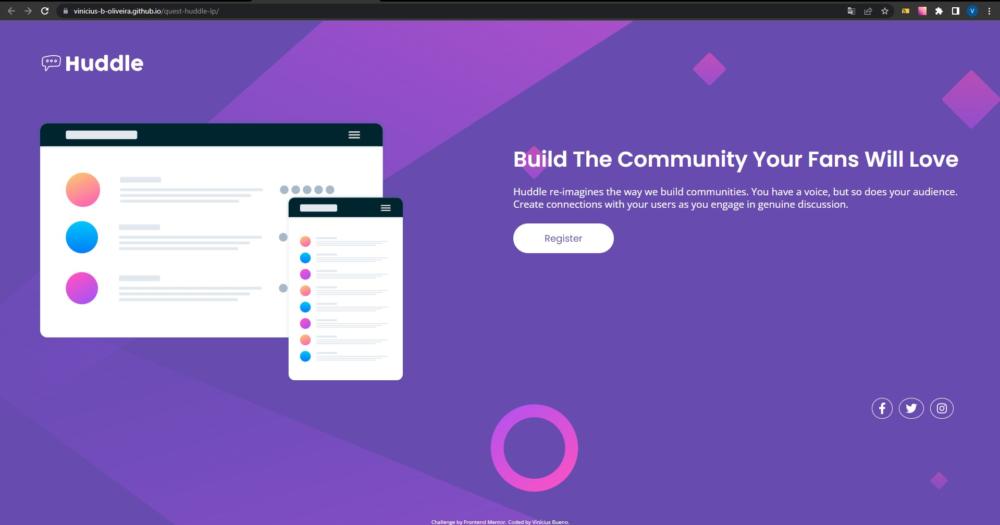

# Frontend Mentor - Huddle Landing Page 

Essa é a minha solução para o desafio [Huddle landing page with single introductory section challenge on Frontend Mentor](https://www.frontendmentor.io/challenges/huddle-landing-page-with-a-single-introductory-section-B_2Wvxgi0).

## Sumário

- [Visão Geral](#visão-geral)
  - [Desafio](#desafio)
  - [Print](#print)
  - [Links](#links)
- [Meu processo](#meu-processo)
  - [Tecnologias](#tecnologias)
  - [Pratica de Aprendizado](#pratica-de-aprendizado)
  - [Habilidades em Desenvolvimento](#habilidades-em-desenvolvimento)
- [Autor](#autor)
- [Agradecimentos](#agradecimentos)

## Visão Geral

### Desafio

- Fazer o projeto da maneira mais fiel possível ao design dado.

### Print



### Links

- Solução: [Ir para solução](https://vinicius-b-oliveira.github.io/quest-huddle-lp/)

## Meu Processo

### Tecnologias

- Marcação semantica com HTML 5
- Folhas de estilo em cascata no CSS 3
- Estilos flexiveis usando CSS Flexbox
- layouts de página em Grid
- Armazenamento de prorpriedades usando variáveis CSS
- Git para versionamento de código

### Pratica de Aprendizado

Com esse projeto foi possível praticar algumas tecnologias CSS como o flex box e grid, por exemplo, além de trabalhar com as media querry de forma mais eficiente, criando primeiramente o modelo mobile e usando-as para modificar o estilo desktop.  

Segue abaixo um trecho de código com os conhecimentos relatados acima: 
```css
.content {
    display: grid;
    grid-template-areas: "illustration"
                         "description";
    grid-template-columns: 1fr;
    row-gap: 58px;
}

.social-medias {
    margin-top: 65px;
    display: flex;
    justify-content: center;
    gap: 12px;
}

@media (min-width: 1000px) {
    body {
        background: url(../img/bg-desktop.svg) no-repeat var(--page-bg-color);
        background-size: cover;
    }

    ...
}
```

### Habilidades em Desenvolvimento

Evoluir na habilidade de escrever códigos limpos, o chamado Clean Code. 

## Autor

- Github - [Vinicíus Bueno](https://github.com/Vinicius-b-oliveira)
- Frontend Mentor - [Vinicíus Bueno](https://www.frontendmentor.io/profile/Vinicius-b-oliveira)

## Agradecimentos

Projeto realizado durante o curso de programação [Dev Quest](https://devemdobro.com/matriculas-abertas/) sobre mentoria dos gêmeos Ricardo Dias e Roberto Dias. 